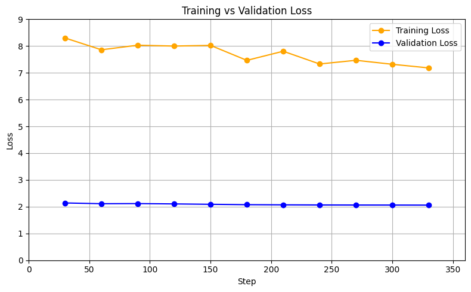

# 🧠 Materials‑Science Domain‑Adapted LLaMA 3 8B (Prof. A.K. Singh Corpus)

This repository contains a **domain-adapted LLaMA 3 8B** model, further pre-trained on **223 materials‑science papers** authored by Prof. Abhishek K. Singh.

---

## 📊 Perplexity Results

- **Perplexity:** 9.4790  
- **Tokens evaluated:** 51,100  
- **Avg. tokens per sample:** 511.0

## 📈 Training vs. Validation Loss

The figure below shows the model’s learning curves during domain-adaptive pretraining:




## 🧪 Workflow Overview

- **`pdf_to_txt_data_extract.ipynb`**  
  Extracts text from PDF research papers into `.txt` files.

- **`hf_dataprep.ipynb`**  
  Preprocesses raw text files into chunks (e.g., 1024 tokens) suitable for training.

- **`dapt-final-aks-mrc.ipynb`**  
  Full pipeline: loads base LLaMA 3 8B, dataset prep, DAPT, evaluation, merging, and model publishing to Hugging Face Spaces, plus inference.

- **`train_test_loss.png`**  
  Visualizes train/validation loss curves during DAPT.


## 🚀 Usage

1. **Clone the repo**  
   ```bash
   git clone https://github.com/harshu0117/Materials_IISC_AKS.git
   cd Materials_IISC_AKS


2. **Install dependencies**

   ```bash
   pip install -r requirements.txt
   ```

3. **Follow notebooks** in order:

   * `pdf_to_txt_data_extract.ipynb` → raw text extraction
   * `hf_dataprep.ipynb` → chunked dataset creation
   * `dapt-final-aks-mrc.ipynb` → model training, evaluation, merge, and deployment

4. **Load the model** in Hugging Face Transformers:

   ```python
    from transformers import AutoTokenizer, AutoModelForCausalLM
    import torch
    
    # Load your model from Hugging Face
    model_name = "Harshu0117/Materials_IISC_MRC"
    tokenizer = AutoTokenizer.from_pretrained(model_name)
    model = AutoModelForCausalLM.from_pretrained(model_name, torch_dtype=torch.float16, device_map="auto")

   ```

5. **Inference example**:

   ```python
   # Set pad token if not set
    if tokenizer.pad_token is None:
       tokenizer.pad_token = tokenizer.eos_token
    
    # Inference
    inputs = tokenizer("Crystalline MAX Phases and their 2D derivative MXenes", return_tensors="pt").to("cuda")
    
    outputs = model.generate(
       **inputs,
       max_new_tokens=200,
       repetition_penalty=1.2,
       temperature=0.8,
       top_k=50,
       top_p=0.95,
       do_sample=True,
       pad_token_id=tokenizer.pad_token_id
    )
    
    print(tokenizer.decode(outputs[0], skip_special_tokens=True))
   ```

---

## 🎯 Why It Matters

Continuing pretraining (DAPT) on Prof. Singh’s materials‑science corpus allows the model to **better understand domain‑specific language**, leading to improved performance on tasks like technical summarization, Q\&A, and synthesis of scientific content.

---

## 📂 File Structure

```
Materials_IISC_AKS/
├── pdf_to_txt_data_extract.ipynb
├── hf_dataprep.ipynb
├── dapt-final-aks-mrc.ipynb
├── train_test_loss.png
└── requirements.txt
```

---

## ✨ Get Involved

* Use the model in your research or applications.
* Open an issue if you'd like to add evaluation benchmarks or new features.
* Star ⭐️ the repo to show support!

---

## 📝 Citation

If you use this model, please cite:

```
@misc{aks_llama3_dapt,
  title = {Domain‑Adaptive Pretraining of LLaMA‑3 8B on Materials‑Science Corpus by A.K. Singh},
  author = {Harshu and Abhishek K. Singh},
  howpublished = {GitHub repository},
  year = {2025},
  url = {https://github.com/harshu0117/Materials_IISC_AKS}
}
```

## 📜 License

This project is licensed under the MIT License — see the [LICENSE](LICENSE) file for details.

---


